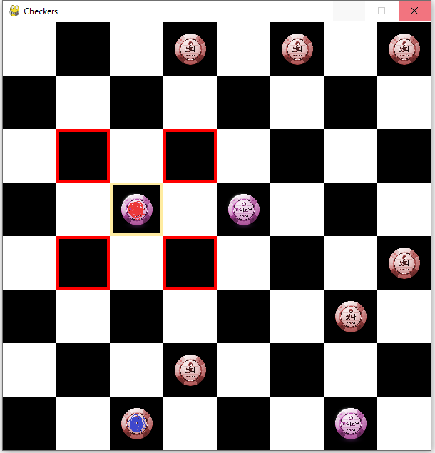
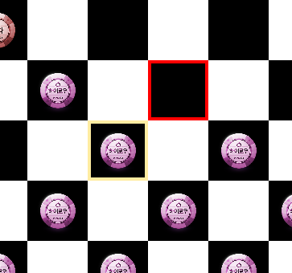

# Checkers Game with AI (Alpha-Beta Pruning).

## 📌Description

This project is made for course *Algorithms and Data structures*.
This is a checkers game made in python that allows player to play against bot.
Bot is designed using alpha beta prunnig algorithm.

## ✨ Features
 - Playable checkers game with GUI
 - AI opponent using Alpha-Beta pruning
 - Calculating time for each move
 - 2 rule modes
 - 2 player mode (*working on it*)


## 📝Rules

Rules are standard checkers game rules. 




You have board with 2 colored chips (red and purple).
The main goal is to eat all opponent's chips. You can move only up. To perform a move, the chip must 
have empty cell on either left diagonal square, or right diagonal square. 


(Left diagonal square is occupied)

After your chip reaches top row, it becomes special chip, and now you can move in all 4 directions.
(Same for the opponent, but he has to reach bottom row).


 Special chips


## 🎮Gameplay
After starting the game, you will be asked if eating moves are required. Then game window
will pop up and you can play the game. If eating moves are required, light yellow border will appear
around your chips that needs to be played.

Every click on your chip will display possible moves. After you, bot play's, and you take turns until
someone wins or you exit the game.

Good luck!

## 🧠 AI bot
The bot against you will play uses **mini-max algorithm** with **alpha beta prunning** for time optimization.
### Minimax algorithm🧠
The **Minimax algorithm** is a decision-making algorithm used in turn-based games.
It assumes that both players play optimally and tries to minimize the potential loss while
 maximizing the potential gain.
  - The **AI (Maximizing Player)** tries to choose the move that gives the highest possible score.
  - The **Opponent (Minimizing Player)** tries to choose the move that gives the lowest possible score.

How it works?
 1. Generate all possible moves for the current player. (Nodes)
 2. Recursively evaluate each move using the Minimax function.
 3. If it's the AI's turn (Maximizing Player), choose the move with the highest evaluation.
 4. If it's the opponent's turn (Minimizing Player), choose the move with the lowest evaluation.
 5. Continue this process until reaching the depth limit or an endgame state.

### Alpha-Beta prunning✂️
**Alpha-Beta Pruning** is an optimization technique for the **Minimax algorithm**.
 It helps reduce the number of nodes that needs to be evaluated in the game tree by
 eliminating branches that won't affect the final decision. This makes the AI faster and more efficient.

 - **Alpha (α)**: The best value that the maximizing player (AI) can guarantee.
 - **Beta (β):** The best value that the minimizing player (player) can guarantee.
 - During the Minimax traversal, if a position is found where the player has a better 
 move than previously evaluated positions, further evaluation of that branch is **pruned (skipped).**
 
### Heuristic 📊
Since exploring the entire game tree is too much for computers, we use a heuristic function
 to evaluate board positions when a certain depth is reached. The heuristic function assigns a 
 score to each board state to estimate the chances of winning.

 In this project, my heuristic function is `value_of_board`. It looks for certain position of chips,
 number of chips, number of special chips, etc.

 **Heuristic function determines the skill-level of our AI.** 
 
## ⚙️ Installation
 1. **Clone the repository**
 ```
 git clone https://github.com/vedranbajic4/Checkers---minimax-alpha-beta.git
 cd Checkers---minimax-alpha-beta
```
2. **Install pygame** (if you don't have it):
```
pip install pygame
```
3. **Run the game**

```
python main.py
```

## Contact & Contributions 🤝

 - If you find any bugs or have suggestions, open an issue or a pull request.
 - Contact: [bajic196@gmail.com]
 - GitHub: [[my GitHub profile](https://github.com/vedranbajic4)]